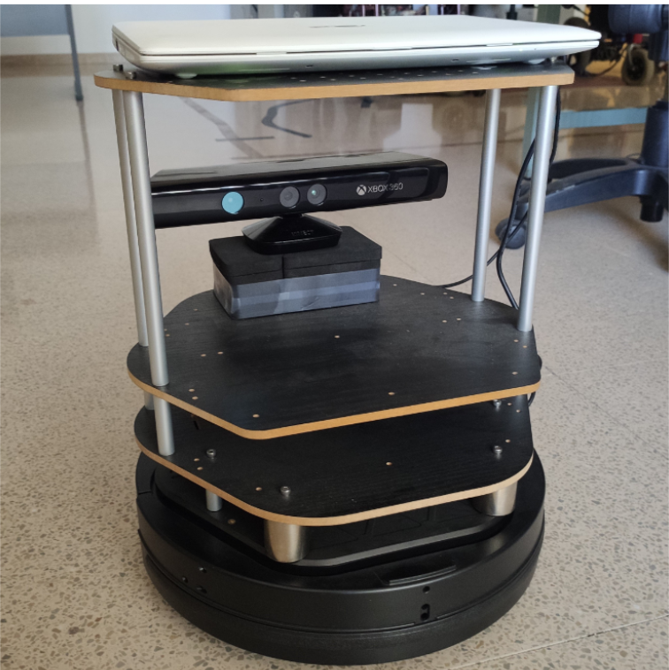
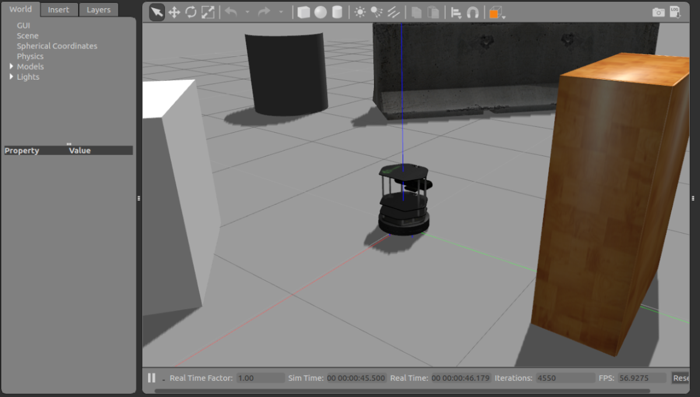

<h1 align="center" >
  
   
  Turtlebot Vision
   
</h1>
<h4 align="center">A study of the efficiency in the communications of turtlebot with vision processed on a local server.

## Introduction
Implementation of nodes for the ROS turtlebot that make use of the images taken by the Microsoft Kinect to evaluate the communication efficiency between a local server and a turtlebot.

 
## Purpose
This project was developed in my last year of university for the Final Degree Project. The purpose of it was to study of the efficiency in the communications of a mobile robot with vision processed on a local server. For this project, I made use of technologies such as ROS (Robot Operating System) to deploy a TurtleBot, both in a real environment and in a simulated one with Gazebo and with the help of OpenCV for image processing. 

## Results
The results I obtained by analyzing TCP connections pointed out that ROS systems are not prepared for wireless transfer of heavy packets.
You can check the paper here but apart from the Abstract, everything is in Spanish (check it out [here](./ROS_TFG.pdf ))
